<p align="center">
  
</p>

# Browse Code

[](https://pypi.org/project/browse-code/)
[](https://pypi.org/project/browse-code/)
[](https://www.python.org/downloads/)
[](https://opensource.org/licenses/MIT)

**Browse Code** is a powerful CLI tool and browser extension that turns any web-based AI chatbot (ChatGPT, Gemini, Claude, HuggingFace) into a fully **autonomous coding agent** (similar to Devin or Antigravity) running right on your local machine.

Stop copy-pasting code back and forth! Browse Code bridges your browser and local terminal, granting your favorite AI the ability to securely read files, execute true regex searches, surgically replace code, and run terminal commands directly in your workspace.

<p align="center">
  
</p>

---

## Why Browse Code?

* **100% Free Autonomous Agents**: Leverage the free tiers of powerful models like Claude 3.5 Sonnet or Gemini 1.5 Pro to build entire projects autonomously without paying for expensive agent services.
* **Local & Secure**: Your code stays on your machine. The AI only reads what it searches for.
* **Seamless Integration**: Works out-of-the-box with ChatGPT, Claude, Gemini, and HuggingFace Chat.
* **Advanced Tooling**: Features true regex codebase searching, precise line-based surgical edits, and asynchronous background process monitoring.

---

## How is this different from Claude Code / Cursor / Devin?

Most autonomous coding tools (like Claude Code, Cursor, or Devin) are **API-based**. This means you must provide your own API keys, and you pay per token for every single file read, search, and edit. Over a long coding session, this can easily cost dollars per hour!

**Browse Code is entirely different.** It operates purely via a Chrome Extension that injects agentic workflows directly into the native web UI of ChatGPT, Gemini, or Claude. 

**This means you don't need ANY API keys!** It hijacks your existing free or Plus subscription and turns the standard web chat into a fully integrated, local execution environment for free.

---

## How It Works

Browse Code consists of two tightly integrated components:

1. **A Local Python Server** (`bc`): Exposes your file system and terminal to the AI via a secure local API.
2. **A Chrome Extension**: Injects agent capabilities and hidden tools directly into the AI chat interface, passing messages back and forth flawlessly.

---

## Quick Setup

### Step 1: Install the Package
```bash
pip install browse-code
```

### Step 2: Run the CLI
You can run the server from anywhere on your machine:
```bash
bc
```
> **Note**: If `bc` is not found, add your Python Scripts folder to PATH, or run directly via `python -m browse_code.cli`.

### Step 3: First-Run Extension Setup (One-Time)
On your very first run, `bc` will guide you through a simple Chrome extension setup:
1. It automatically extracts the extension to `~/.browse_code/extension/` and copies the path to your clipboard.
2. It opens `chrome://extensions/` in your browser.
3. Enable **Developer mode** (top-right), click **Load unpacked**, and paste the path.
4. Press Enter in your terminal. You're done forever!

### Step 4: Start Coding Autonomously
1. Open any supported AI chat (ChatGPT, Gemini, Claude, or HuggingFace Chat).
2. Click the **Browse Code Bridge** extension icon in your browser toolbar and set your workspace directory.
3. Click **Initialize Agent in Chat**.
4. Give the AI a task (e.g., *"Build a React Native app that syncs gallery photos"*) and watch it work entirely on its own!

---

## Core Capabilities

* **Directory Exploration (`view_dir`)**: The AI can map out your project structure.
* **True Regex Search (`search_code`)**: Blazing fast codebase search using compiled Python regex.
* **Surgical Reading (`read_lines`)**: Reads specific chunks of files to preserve LLM token context.
* **Precise Editing (`replace` / `write`)**: Surgically replaces specific code blocks using start/end line bounds to eliminate hallucination, complete with beautiful inline terminal diffs!
* **Terminal Execution (`terminal_run`)**: Runs synchronous shell commands with full stdout/stderr capture (e.g., `git commit`, `ls`).
* **Background Processes (`terminal_bg`)**: Starts and monitors long-running dev servers or build scripts (e.g., `npm run dev`) asynchronously.

---

## For Developers

Want to contribute or hack on Browse Code?

1. Clone the repository:
   ```bash
   git clone https://github.com/Dedeep007/browse_code.git
   cd browse_code
   ```
2. Install in editable mode:
   ```bash
   pip install -e .
   ```

Contributions are always welcome! Feel free to open a Pull Request.

---

## License
Distributed under the MIT License.
